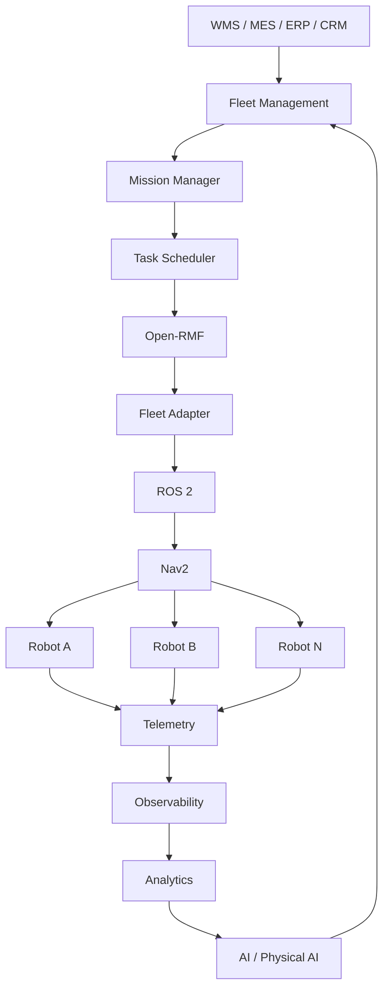
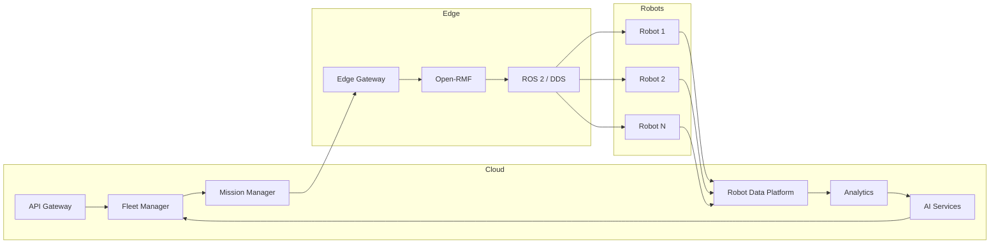
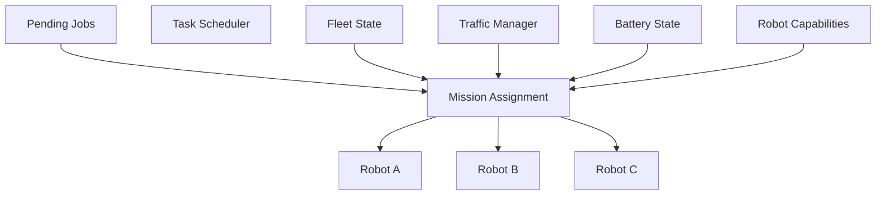
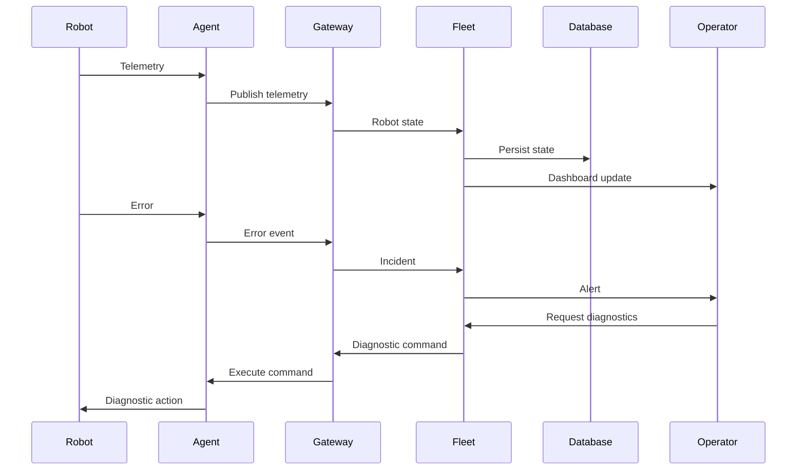
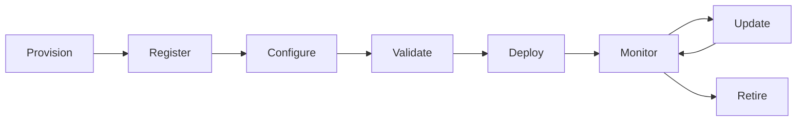
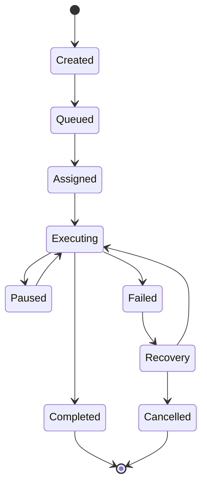
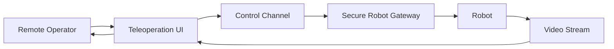
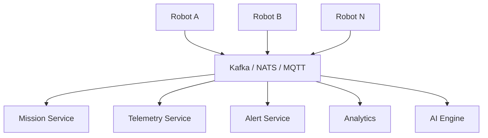
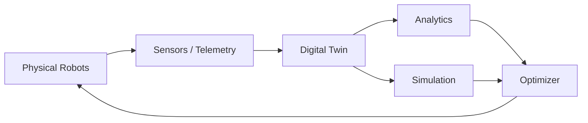

# Awesome-Robotics-Fleet-Management

## Top Robotics Fleet Management Platforms — README.md


A comprehensive guide to **robot fleet management, RobOps, robot orchestration, fleet monitoring, telemetry, remote operations, mission management, deployment, observability, interoperability, and open-source alternatives** to platforms such as **Formant, InOrbit, Freedom Robotics, Rocos, SVT Robotics, Waypoint Robotics, Brain Corp, NVIDIA Mission Control, OTTO Motors, and Viam**.


> **Primary emphasis:** Open-source robotics fleet-management frameworks, robot orchestration platforms, middleware, fleet adapters, observability systems, deployment infrastructure, simulation platforms, and composable building blocks that can be self-hosted to create a commercial-grade **Robotics Fleet Management / RobOps platform**.


---


# Table of Contents


* [What Is Robotics Fleet Management?](#what-is-robotics-fleet-management)

* [SaaS / Hosted Platforms](#saas--hosted-platforms)

* [Open-Source](#open-source)


  * [Full Fleet Management / Multi-Robot Orchestration](#full-fleet-management--multi-robot-orchestration)

  * [Open-RMF Ecosystem](#open-rmf-ecosystem)

  * [Robot Middleware](#robot-middleware)

  * [Navigation & Autonomy](#navigation--autonomy)

  * [Fleet Adapters & Interoperability](#fleet-adapters--interoperability)

  * [Robot Observability](#robot-observability)

  * [Telemetry & Data Infrastructure](#telemetry--data-infrastructure)

  * [Remote Operations & Teleoperation](#remote-operations--teleoperation)

  * [Deployment & Device Management](#deployment--device-management)

  * [Simulation](#simulation)

  * [Mapping & Visualization](#mapping--visualization)

  * [Industrial Robot Integration](#industrial-robot-integration)

  * [Cloud / Edge Infrastructure](#cloud--edge-infrastructure)

  * [AI / Physical AI Building Blocks](#ai--physical-ai-building-blocks)

* [Commercial → Open-Source Mapping](#commercial--open-source-mapping)

* [Robotics Fleet Management Layers](#robotics-fleet-management-layers)

* [Core Architecture](#core-architecture)

* [Reference Architecture](#reference-architecture)

* [Multi-Robot Orchestration](#multi-robot-orchestration)

* [AMR Fleet Architecture](#amr-fleet-architecture)

* [RobOps Architecture](#robops-architecture)

* [Fleet Monitoring Workflow](#fleet-monitoring-workflow)

* [Mission Management](#mission-management)

* [Robot Deployment Lifecycle](#robot-deployment-lifecycle)

* [Fleet Interoperability](#fleet-interoperability)

* [VDA 5050](#vda-5050)

* [Capability Matrix](#capability-matrix)

* [Recommended Open-Source Stacks](#recommended-open-source-stacks)

* [Best Open-Source Choices by Use Case](#best-open-source-choices-by-use-case)

* [What Open Source Can and Cannot Replace](#what-open-source-can-and-cannot-replace)

* [Robot Data Model](#robot-data-model)

* [Fleet State Model](#fleet-state-model)

* [Mission State Machine](#mission-state-machine)

* [Observability](#observability)

* [Remote Diagnostics](#remote-diagnostics)

* [Remote Teleoperation](#remote-teleoperation)

* [Security & Compliance](#security--compliance)

* [Scalability](#scalability)

* [Licensing](#licensing)

* [Open-Source Ecosystem Summary](#open-source-ecosystem-summary)

* [Open-Source Shortlist](#open-source-shortlist)

* [Why Open-RMF Is Particularly Important](#why-open-rmf-is-particularly-important)

* [Why Viam Is Interesting as an Open-Source Building Block](#why-viam-is-interesting-as-an-open-source-building-block)

* [Building a Formant Alternative](#building-a-formant-alternative)

* [Building an InOrbit Alternative](#building-an-inorbit-alternative)

* [Building an NVIDIA Mission Control Alternative](#building-an-nvidia-mission-control-alternative)

* [Building an OTTO / AMR Fleet Manager](#building-an-otto--amr-fleet-manager)

* [Building a Complete Open-Source RobOps Platform](#building-a-complete-open-source-robops-platform)

* [Conclusion](#conclusion)

* [Contributing](#contributing)

* [Disclaimer](#disclaimer)


---


# What Is Robotics Fleet Management?


Robotics fleet management is the software layer used to **deploy, monitor, control, coordinate, diagnose, update, and optimize multiple robots**.


A modern fleet-management platform may provide:


* Robot registration

* Device provisioning

* Fleet organization

* Robot health monitoring

* Telemetry ingestion

* Mission dispatch

* Multi-robot coordination

* Task assignment

* Robot navigation

* Map management

* Battery management

* Charging coordination

* Remote diagnostics

* Remote shell

* Teleoperation

* Video streaming

* Logs

* Alerts

* Incident management

* Software deployment

* Configuration management

* OTA updates

* Robot analytics

* Predictive maintenance

* AI-assisted operations

* Enterprise-system integration

* Multi-vendor robot interoperability


A simplified architecture is:


```text

                     ┌───────────────────────┐

                     │ Enterprise Systems    │

                     │ WMS / MES / ERP / CRM │

                     └───────────┬───────────┘

                                 │

                                 ▼

                     ┌───────────────────────┐

                     │ Fleet Management      │

                     │ / RobOps Platform     │

                     └───────────┬───────────┘

                                 │

             ┌───────────────────┼──────────────────┐

             ▼                   ▼                  ▼

       Mission Manager      Fleet Manager      Analytics

             │                   │                  │

             └───────────────────┼──────────────────┘

                                 ▼

                     ┌───────────────────────┐

                     │ Robot Middleware      │

                     │ ROS 2 / DDS / Zenoh   │

                     └───────────┬───────────┘

                                 │

            ┌────────────────────┼────────────────────┐

            ▼                    ▼                    ▼

        Robot A              Robot B              Robot N

```


---


# SaaS / Hosted Platforms


The following commercial platforms cover various parts of robot fleet management, RobOps, robot orchestration, autonomy, device management, industrial interoperability, and AMR operations.


| Platform | Primary Focus | Typical Strength | Starting Pricing | Free Tier / Free Trial Limits |
| :--- | :--- | :--- | :--- | :--- |
| **[Formant](https://formant.io/)** | Robotics operations | Fleet orchestration, observability, teleoperation | Starts at **$250 / robot / month** (teleoperation & real-time telemetry streaming) | **Free Forever Tier** (Formant Studio): 1 user seat with unlimited connected robots for live monitoring, teleoperation, and SSH access; **30-day trial** for enterprise fleets. |
| **[InOrbit](https://www.inorbit.ai/)** | RobOps | Robot operations and orchestration | Starts at **$5,000 / year** (Developer Edition flat annual fee for up to 8 robots; or ~$100 / robot / month) | **Free Forever Edition**: Unlimited robots for core fleet status, health telemetry, and incident tracking (no credit card required). |
| **[Freedom Robotics](https://freedomrobotics.ai/)** | Fleet management | Device/fleet/deployment management | Starts at **$59 / robot / month** (Standard plan for real-time telemetry, remote SSH, and alerting) | **14-day free trial** with full platform capabilities for up to 3 robots (includes video streaming and control; no credit card required). |
| **[Rocos (DroneDeploy Ground)](https://www.rocos.io/)** | Robotics cloud | Fleet operations and robot management | Starts at **$349 / month** ($4,188 billed annually for Core Ground Robotics & Reality Capture) | **14-day free trial** with full access (up to 1 robot/drone integration and 500 image captures/maps; no credit card required). |
| **[SVT Robotics](https://svtrobotics.com/)** | Industrial robotics | Robot deployment/interoperability | Starts at **$25,000 / year** (~$2,083 / month base SOFTBOT platform connector subscription) | **30-day sandbox pilot trial** with access to AppDirectory virtual connectors, mock robot endpoints, and simulated WMS workflows. |
| **[Waypoint Robotics](https://waypointrobotics.com/)** | AMRs | Autonomous mobile robots | Starts at **$2,500 / robot / month** (RaaS lease covering Vector AMR hardware, Dispatcher software, and maintenance) | **30-day on-site pilot evaluation** including 1 Vector AMR unit, virtual facility mapping, and Dispatcher software setup. |
| **[Brain Corp](https://www.braincorp.com/)** | Autonomous robots | BrainOS + commercial fleet ecosystem | Starts at **$499 / robot / month** (BrainOS commercial software & fleet telemetry license) | **30-day proof-of-concept trial** per facility site (includes pre-mapped routes, cloud analytics portal, and operator training). |
| **[NVIDIA](https://www.nvidia.com/)** | Robotics platform | Isaac, Mission Control, simulation and AI | **$0** (Free core software download); Enterprise Support starts at **$4,500 / GPU / year** (or $1.00 / GPU-hr on CSPs) | **Free Forever**: Isaac Sim, Isaac ROS, and Omniverse core platform are free for local development; **90-day free trial** via NVIDIA LaunchPad. |
| **[OTTO Motors](https://ottomotors.com/)** | Industrial AMRs | Warehouse/manufacturing automation | Starts at **$2,500 / robot / year** (OTTO Fleet Manager software license; or RaaS bundled lease from ~$2,800 / robot / month) | **30-day pilot sandbox evaluation** with virtual OTTO Fleet Manager simulator, fleet route builder, and throughput benchmark reports. |
| **[Viam](https://www.viam.com/)** | Robotics platform | Hardware abstraction, deployment, data and fleet operations | **$5 / month base minimum threshold**; then $0.25 / GB / month data management, $2.50 / GB hot storage, $0.00125 / sec compute | **Free Forever Plan**: First **$5 / month of cloud usage free forever** (unlimited connected machines, local orchestration, and WebRTC streaming; no credit card required). |
| **[Locus Robotics](https://locusrobotics.com/)** | Warehouse robotics | AMR orchestration | Starts at **$1,200 / robot / month** (RaaS subscription covering LocusBot AMR, LocusONE cloud orchestration, and maintenance) | **30-day pilot proof-of-concept program** (includes multi-bot simulation, facility throughput modeling, and on-site zone testing). |
| **[6 River Systems](https://6river.com/)** | Warehouse robotics | Collaborative AMRs | Starts at **$1,500 / robot / month** (RaaS lease covering Chuck AMR, fleet management software, and 24/7 technical support) | **30-day proof-of-concept trial** including 2 Chuck AMRs, cart mapping, WMS test integration, and picking productivity analysis. |
| **[MiR](https://mobile-industrial-robots.com/)** | Industrial AMRs | Fleet management | Starts at **$3,500 one-time base license** for MiR Fleet software (or MiR Insights cloud analytics at **$150 / robot / month**) | **30-day free evaluation license** for MiR Fleet server software (full features up to 100 AMRs in simulation/staging mode). |
| **[KUKA](https://www.kuka.com/)** | Industrial robotics | Robot control and automation | Starts at **€2,400 / year (~$2,600 / year)** for KUKA.Sim modular license (or KUKA Connect Plus at **€35 / robot / month**) | **Free Forever Plan** (KUKA Connect Lite): Basic asset info and status monitoring for registered KUKA robots; **30-day full-feature trial** for KUKA.Sim. |
| **[ABB Robotics](https://new.abb.com/products/robotics)** | Industrial robotics | Robot fleet / industrial automation | Starts at **$600 / robot / year (~$50 / month)** for ABB Ability Connected Services (or RobotStudio Premium at **$1,500 / year**) | **Free Forever Plan** (RobotStudio Basic): Essential 3D CAD viewer and basic simulation; **30-day free trial** for RobotStudio Premium. |
| **[FANUC](https://www.fanucamerica.com/)** | Industrial robotics | Factory robotics | Starts at **$1,200 / robot / year (~$100 / month)** for FANUC ZDT cloud predictive maintenance subscription | **30-day free evaluation trial** for FIELD system developer sandbox and FANUC RoboGuide simulation upon distributor request. |
| **[Universal Robots](https://www.universal-robots.com/)** | Collaborative robots | Robot automation ecosystem | Starts at **$1,200 / robot / year (~$100 / month)** for UR Care / UR Connect cloud monitoring & remote diagnostics | **Free Forever Plan**: UR Studio browser simulator and URSim offline robot simulator free forever; **30-day evaluation trial** for UR Connect. |
| **[Dusty Robotics](https://dustyrobotics.com/)** | Construction robotics | Autonomous layout robots | Starts at **$3,000 / month** ($1,250 / day lease rate) for FieldPrint Platform software and robot hardware subscription | **1-day on-site layout benchmark demo** + **14-day CAD/BIM model conversion trial** on the FieldPrint web portal. |
| **[Canvas](https://www.canvas.build/)** | Construction robotics | Autonomous construction robots | Starts at **$5,000 / month** (RaaS lease for 1200CX autonomous machine + software; or ~$0.65 / sq ft subcontracting rate) | **1-day on-site jobsite demonstration** and single-room mock-up finishing evaluation before contract execution. |
| **[PickNik](https://picknik.ai/)** | Robot motion | ROS / MoveIt-based robotics | Starts at **$1,000 / seat / month (~$10,000 / year)** for MoveIt Pro commercial developer license | **Free Forever Plan**: Free MoveIt Pro Academic License for universities/researchers + MoveIt OSS core; **30-day free trial** for enterprise evaluation. |
| **[Intrinsic](https://intrinsic.ai/)** | Industrial robotics | Robotics software platform | Starts at **$2,000 / developer / month** (enterprise Flowstate studio seat subscription for production engineering teams) | **60-day gated trusted-tester developer preview** (includes cloud simulation credits and access to open-source Python/C++ Skill SDK). |
| **[NVIDIA Isaac](https://developer.nvidia.com/isaac)** | Robotics AI | Simulation, autonomy and accelerated computing | **$0** (Free core Isaac Sim/ROS developer download); Cloud deployment via NVIDIA AI Enterprise starts at **$4,500 / GPU / year** | **Free Forever**: Isaac Sim, Isaac Lab, and Isaac ROS libraries are completely free for local GPU development; **90-day free cloud trial** via LaunchPad. |
| **[AWS RoboMaker](https://aws.amazon.com/robomaker/)** | Robotics cloud tooling | Cloud robotics development | **$0.40 per Simulation Unit (SU) hour** (1 SU = 1 vCPU + 2 GB RAM; ~$290 / month for 1 dedicated continuous worker) | **AWS Free Tier (12 Months)**: **25 Simulation Unit (SU) hours per month free** for 12 months (Note: transitioning to AWS IoT Greengrass & Batch). |
| **[Azure Robotics](https://azure.microsoft.com/)** | Cloud robotics | Cloud/IoT integration | Starts at **$10 / month** (Azure IoT Hub Basic B1, 400k msgs/day) or **$0.75 / vCPU / month** for Azure Arc IoT Operations | **Free Forever Tier** (IoT Hub F1): **8,000 messages / day free forever** (up to 500 connected devices) + **30-day trial with $200 Azure credits**. |
| **[Google Cloud Robotics](https://cloud.google.com/robotics)** | Cloud robotics | Robotics cloud infrastructure | Starts at **$0.10 / cluster / hour (~$73 / month)** for GKE cluster management fee + compute node resources (e2-medium from ~$25 / month) | **Free Forever Tier**: **1 free zonal GKE cluster per billing account forever** ($73/mo fee waived) + **$300 free credits across 90-day Google Cloud trial**. |
| **[Foxglove](https://foxglove.dev/)** | Robotics observability | Visualization, telemetry indexing, RobOps data platform | Starts at **$18 / user / month** ($15 / user / month billed annually for Team tier) | **Free Forever Plan**: 1 user, up to 10 GB cloud storage, unlimited local visualization, web and desktop client (no credit card required). |


> Commercial offerings differ significantly: some are true fleet-management systems, while others focus on robot hardware, industrial orchestration, autonomy, simulation, or integration. A single commercial product should therefore not be assumed to be a complete substitute for another.


---


# Open-Source


Open-source robotics fleet management is best understood as a **stack of interoperable projects** rather than one universal product.


The most important open-source ecosystem is:


```text

                    OpenStreetMap / Maps

                            │

                            ▼

                       ROS 2 / DDS

                            │

              ┌─────────────┴─────────────┐

              ▼                           ▼

          Nav2 / SLAM                 Robot SDK

              │                           │

              └─────────────┬─────────────┘

                            ▼

                      Fleet Adapter

                            │

                            ▼

                      Open-RMF

                            │

              ┌─────────────┼─────────────┐

              ▼             ▼             ▼

           Robot A       Robot B       Robot N

              │             │             │

              └─────────────┼─────────────┘

                            ▼

                    Fleet Operations

                            │

            ┌───────────────┼────────────────┐

            ▼               ▼                ▼

        Telemetry       Monitoring        Analytics

```


---


# Full Fleet Management / Multi-Robot Orchestration


## 1. Open-RMF


**Open Robotics Middleware Framework**


GitHub:


https://github.com/open-rmf/rmf


Open-RMF is one of the most important open-source foundations for **multi-fleet robot management**.


It is specifically designed to coordinate fleets of robots and infrastructure.


Capabilities include:


* Multi-fleet coordination

* Traffic management

* Task dispatch

* Fleet adapters

* Robot interoperability

* Door integration

* Lift integration

* Building infrastructure

* Scheduling

* Negotiation

* Navigation coordination

* Shared maps

* Task planning


Open-RMF is particularly relevant to:


* AMR fleets

* Warehouses

* Hospitals

* Airports

* Hotels

* Campuses

* Manufacturing

* Multi-vendor environments


The project describes itself as a platform for **multi-fleet robot management** and provides adapters for integrating different robots and systems.


---


# 2. Free Fleet


GitHub:


https://github.com/open-rmf/free_fleet


Free Fleet is an open-source implementation of an Open-RMF fleet adapter designed to communicate with robot navigation stacks.


It uses **Zenoh** as a communication layer and can bridge ROS 2/ROS 1 systems into fleet management.


Useful for:


* AMR fleets

* ROS robots

* Nav2

* Multi-robot coordination

* Cloud-to-robot communication


---


# 3. Toyota FREEDOM


GitHub:


https://github.com/Toyota/FREEDOM


FREEDOM is an open-source platform from Toyota for orchestrating robots, equipment and factory infrastructure.


It provides:


* Unified robot portal

* Multiple robot APIs

* Job creation

* Robot control

* Infrastructure-linked zones

* Factory integration

* Microservice architecture


The project is licensed under Apache 2.0 for the current release.


This is particularly interesting because it represents a **production-oriented open-source fleet orchestration architecture**, rather than only a robotics research framework.


---


# 4. NVIDIA Isaac Mission Control


GitHub:


https://github.com/nvidia-isaac/isaac_mission_control


NVIDIA Mission Control is a lightweight fleet-management/orchestration component in the Isaac ecosystem.


It coordinates:


* Missions

* Behavior trees

* Maps

* Route planning

* Mission dispatch

* VDA5050

* Isaac ecosystem components


However, NVIDIA explicitly notes that **full robot fleet management is not currently built into Mission Control**; robots are configured as controlled robots through Mission Dispatch.


Therefore:


> Mission Control is an important open-source robotics orchestration component, but should not be treated as a complete Formant/InOrbit replacement by itself.


---


# 5. OpenRobOps


InOrbit's documentation now identifies **OpenRobOps** as an open-source fleet-management platform for developers who want to build on-premises or self-hosted solutions.


This is especially relevant because it targets the same general architectural problem as commercial RobOps platforms.


---


# Open-RMF Ecosystem


The Open-RMF ecosystem is worth treating as its own category.


```text

                         Open-RMF

                            │

        ┌───────────────────┼────────────────────┐

        ▼                   ▼                    ▼

    Task System        Traffic System      Fleet Adapters

        │                   │                    │

        ▼                   ▼                    ▼

   Task Planner         Traffic Manager     Robot Fleet

        │                   │                    │

        └───────────────────┼────────────────────┘

                            ▼

                     Building Systems

                            │

                  ┌─────────┼─────────┐

                  ▼         ▼         ▼

                Doors      Lifts    Chargers

```


Important projects include:


* `rmf`

* `rmf_traffic`

* `rmf_task`

* `rmf_fleet_adapter`

* `fleet_adapter_template`

* `free_fleet`

* `rmf_demos`

* `rmf_visualization`

* `rmf_web`


Open-RMF supports ROS 2 distributions including Humble, Jazzy, Kilted and Rolling according to its current repository documentation.


---


# Robot Middleware


## ROS 2


Website:


https://www.ros.org/


GitHub:


https://github.com/ros2


ROS 2 is the most important open-source middleware ecosystem for modern robotics.


It provides:


* Nodes

* Topics

* Services

* Actions

* Lifecycle management

* Parameters

* DDS communication

* Discovery

* Composition

* Security

* Simulation integration


A large portion of the open-source fleet-management ecosystem is built around ROS 2.


---


# DDS


ROS 2 commonly uses DDS-based middleware.


Important implementations include:


* Fast DDS

* Cyclone DDS

* RTI Connext DDS


Open-source options include:


### Fast DDS


https://github.com/eProsima/Fast-DDS


### Cyclone DDS


https://github.com/eclipse-cyclonedds/cyclonedds


---


# Zenoh


GitHub:


https://github.com/eclipse-zenoh/zenoh


Zenoh is increasingly useful for robotics systems requiring:


* Distributed communication

* Edge/cloud connectivity

* ROS 2 bridging

* Low-bandwidth environments

* WAN robotics

* Fleet communication


Free Fleet uses Zenoh as a communication layer for connecting fleets to navigation stacks.


---


# Navigation & Autonomy


## Nav2


GitHub:


https://github.com/ros-navigation/navigation2


Nav2 is the standard open-source navigation framework for ROS 2.


Capabilities include:


* Path planning

* Path following

* Recovery behaviors

* Localization

* Costmaps

* Waypoint following

* Behavior trees

* Lifecycle nodes

* Navigation plugins


A typical AMR architecture is:


```text

Fleet Manager

      │

      ▼

Open-RMF

      │

      ▼

Fleet Adapter

      │

      ▼

ROS 2

      │

      ▼

Nav2

      │

      ├── Localization

      ├── Planner

      ├── Controller

      ├── Costmaps

      └── Recovery

```


---


# SLAM Toolbox


GitHub:


https://github.com/SteveMacenski/slam_toolbox


Useful for:


* Mapping

* Localization

* Map updates

* 2D SLAM


---


# RTAB-Map


GitHub:


https://github.com/introlab/rtabmap


Useful for:


* RGB-D SLAM

* Visual SLAM

* 3D mapping

* Localization


---


# MoveIt


Website:


https://moveit.picknik.ai/


GitHub:


https://github.com/moveit/moveit2


MoveIt 2 provides motion planning for robotic manipulators.


Useful when the fleet contains:


* Robotic arms

* Mobile manipulators

* Autonomous workcells

* Pick-and-place robots


---


# Fleet Adapters & Interoperability


## VDA 5050


VDA 5050 is an important interoperability standard for automated mobile robots.


It enables communication between:


* Master control systems

* Fleet managers

* AMRs

* Navigation systems


Typical architecture:


```text

               Fleet Manager

                     │

                     │ VDA 5050

                     ▼

              ┌─────────────┐

              │     AMR     │

              └─────────────┘

```


Open-source VDA 5050 implementations can be found throughout the ROS 2 ecosystem.


---


# Open-RMF Fleet Adapter Template


GitHub:


https://github.com/open-rmf/fleet_adapter_template


This provides a starting point for integrating a robot fleet into Open-RMF.


---


# Free Fleet


GitHub:


https://github.com/open-rmf/free_fleet


Particularly useful when robots already use:


* ROS

* ROS 2

* Nav1

* Nav2


Free Fleet provides a bridge between fleet-management systems and robot navigation stacks.


---


# Robot Observability


A fleet manager needs significantly more than location tracking.


It should capture:


* Robot state

* CPU

* Memory

* Battery

* Temperature

* Motor state

* Navigation state

* Localization confidence

* Sensor health

* Network connectivity

* Errors

* Warnings

* Mission status

* Task duration

* Intervention events

* Video

* Images

* Logs


---


# Foxglove


Website:


https://foxglove.dev/


GitHub:


https://github.com/foxglove


Foxglove provides robotics visualization and observability tools.


Useful for:


* ROS data

* Sensor streams

* Logs

* Robot state

* 3D visualization

* Playback

* Debugging

* Fleet diagnostics


It can be a major component of an open RobOps observability layer.


---


# PlotJuggler


GitHub:


https://github.com/facontidavide/PlotJuggler


Useful for time-series analysis of robot telemetry.


---


# rqt


ROS 2 tooling:


https://github.com/ros2/rqt


Useful for:


* Diagnostics

* Topics

* Parameters

* Visualization

* Debugging


---


# Telemetry & Data Infrastructure


## rosbag2


GitHub:


https://github.com/ros2/rosbag2


Useful for recording and replaying robot telemetry.


```text

Robot

 │

 ├── Camera

 ├── LiDAR

 ├── IMU

 ├── GPS

 ├── Odometry

 └── Diagnostics

        │

        ▼

     rosbag2

        │

        ▼

     Storage

        │

        ▼

   Analytics / AI

```


---


# MCAP


Website:


https://mcap.dev/


GitHub:


https://github.com/foxglove/mcap


MCAP is a robotics data-recording format designed for high-performance storage and interoperability.


Useful for:


* Sensor data

* ROS data

* Telemetry

* Robotics datasets

* AI training

* Fleet incident replay


---


# OpenTelemetry


https://opentelemetry.io/


Although not robotics-specific, OpenTelemetry can provide:


* Distributed traces

* Metrics

* Logs

* Service observability


A mature RobOps platform can combine:


```text

Robot Telemetry

+

ROS Diagnostics

+

OpenTelemetry

+

Prometheus

+

Grafana

+

Loki

+

MCAP

```


---


# Prometheus


https://prometheus.io/


Ideal for:


* CPU metrics

* Memory

* Robot availability

* Battery

* Network metrics

* Service health

* Fleet KPIs


---


# Grafana


https://grafana.com/oss/grafana/


Useful for:


* Fleet dashboards

* Alerts

* Time-series visualization

* Robot health

* Operations dashboards


---


# Loki


https://grafana.com/oss/loki/


Useful for centralized log aggregation.


---


# Remote Operations & Teleoperation


Commercial platforms such as Formant combine fleet monitoring with remote intervention and teleoperation.


An open architecture can use:


```text

Robot

  │

  ├── Camera

  ├── LiDAR

  ├── State

  └── Control

       │

       ▼

  WebRTC / ROS Bridge

       │

       ▼

  Teleoperation Server

       │

       ▼

  Operator Console

```


---


# WebRTC


https://webrtc.org/


Useful for:


* Low-latency video

* Audio

* Teleoperation

* Remote operator sessions


---


# WebRTC ROS Integrations


ROS-compatible WebRTC bridges can be built using:


* `rosbridge_suite`

* WebRTC

* custom ROS 2 bridges

* Foxglove/WebSocket infrastructure


---


# rosbridge_suite


GitHub:


https://github.com/RobotWebTools/rosbridge_suite


Provides JSON/WebSocket access to ROS systems.


Useful for:


* Web dashboards

* Remote control

* Browser interfaces

* Custom fleet-management UIs


---


# Deployment & Device Management


A RobOps platform should support:


* Robot provisioning

* Configuration

* Version management

* Software deployment

* Rollback

* OTA updates

* Device health

* Certificates

* Secrets

* Remote access


---


# Ansible


https://www.ansible.com/


Useful for:


* Robot configuration

* OS configuration

* Fleet provisioning

* Package deployment

* Security hardening


---


# Docker


https://www.docker.com/


Useful for containerizing:


* Robot applications

* ROS nodes

* Fleet agents

* APIs

* Analytics services


---


# Kubernetes


https://kubernetes.io/


Useful for:


* Cloud services

* Fleet-management backends

* Data processing

* Analytics

* AI inference

* Multi-tenant control planes


Edge Kubernetes options include:


* K3s

* MicroK8s

* KubeEdge


---


# K3s


https://k3s.io/


Useful for lightweight edge deployments.


---


# Mender


https://github.com/mendersoftware/mender


Open-source OTA update infrastructure.


Useful for:


* Firmware updates

* OS updates

* Software updates

* Rollbacks

* Device management


---


# balena


https://www.balena.io/


A platform for managing fleets of Linux/IoT devices.


Useful for robotics deployments where containerized device management is required.


---


# Simulation


## Gazebo


https://gazebosim.org/


GitHub:


https://github.com/gazebosim/gz-sim


Useful for:


* Robot simulation

* Fleet simulation

* Navigation testing

* Sensor simulation

* Regression testing


---


# NVIDIA Isaac Sim


https://developer.nvidia.com/isaac/sim


Useful for:


* Photorealistic simulation

* Synthetic data

* Robot testing

* AI training

* Digital twins

* Multi-robot simulation


---


# Webots


https://cyberbotics.com/


Open-source robotics simulator.


---


# CoppeliaSim


https://www.coppeliarobotics.com/


Robotics simulation platform with broad support for:


* Manipulators

* Mobile robots

* Sensors

* Planning

* Simulation


---


# Mapping & Visualization


## RViz2


https://github.com/ros2/rviz


Core ROS 2 visualization system.


---


# MapLibre


https://maplibre.org/


Useful for web-based fleet maps.


```text

              Fleet Dashboard

                    │

                    ▼

                MapLibre

                    │

        ┌───────────┼───────────┐

        ▼           ▼           ▼

      Robot A     Robot B     Robot N

```


---


# Industrial Robot Integration


Important open-source ecosystems include:


* ROS-Industrial

* MoveIt

* OPC UA

* MQTT

* Modbus

* EtherCAT ecosystems

* PLC integration

* VDA 5050

* Open-RMF


---


# ROS-Industrial


Website:


https://rosindustrial.org/


GitHub:


https://github.com/ros-industrial


Useful for integrating ROS with industrial robots and automation equipment.


---


# OPC UA


https://opcfoundation.org/


A major industrial interoperability standard.


Typical architecture:


```text

Robot / PLC

     │

     ▼

 OPC UA

     │

     ▼

Industrial Gateway

     │

     ▼

Fleet / MES / WMS

```


---


# Cloud / Edge Infrastructure


A modern fleet-management platform normally separates:


```text

                 CLOUD

                   │

        ┌──────────┼───────────┐

        ▼          ▼           ▼

      Fleet      Analytics     AI

      Manager      │           │

        │          │           │

        └──────────┼───────────┘

                   │

                 EDGE

                   │

        ┌──────────┼───────────┐

        ▼          ▼           ▼

      Robot A   Robot B      Robot N

```


Useful technologies:


* Kubernetes

* K3s

* Docker

* NATS

* Kafka

* MQTT

* PostgreSQL

* Redis

* MinIO

* OpenTelemetry

* Prometheus

* Grafana


---


# MQTT


https://mqtt.org/


Useful for lightweight robot and IoT messaging.


Open-source brokers include:


* Eclipse Mosquitto

* EMQX Community

* HiveMQ Community components where applicable


---


# NATS


https://nats.io/


Useful for:


* Robot events

* Mission events

* Low-latency messaging

* Fleet orchestration

* Cloud/edge communication


---


# Redis


https://redis.io/


Useful for:


* Fleet state

* Caching

* Job queues

* Locks

* Mission state

* Real-time dashboards


---


# PostgreSQL + PostGIS


https://www.postgresql.org/


https://postgis.net/


Useful for:


* Robot metadata

* Facilities

* Maps

* Zones

* Mission history

* Geofences

* Spatial queries


---


# AI / Physical AI Building Blocks


Modern platforms increasingly add AI to fleet operations.


Useful open-source technologies include:


| Project                                                                                            | Role                 |

| -------------------------------------------------------------------------------------------------- | -------------------- |

| [PyTorch](https://pytorch.org/)                                                                    | AI/ML                |

| [ONNX Runtime](https://onnxruntime.ai/)                                                            | Model inference      |

| [OpenVINO](https://www.intel.com/content/www/us/en/developer/tools/openvino-toolkit/overview.html) | Edge AI              |

| [NVIDIA Isaac ROS](https://nvidia-isaac-ros.github.io/)                                            | Accelerated robotics |

| [OpenCV](https://opencv.org/)                                                                      | Computer vision      |

| [YOLO](https://github.com/ultralytics/ultralytics)                                                 | Object detection     |

| [Transformers](https://github.com/huggingface/transformers)                                        | AI models            |

| [LlamaIndex](https://github.com/run-llama/llama_index)                                             | AI data integration  |

| [LangChain](https://github.com/langchain-ai/langchain)                                             | AI orchestration     |

| [Qdrant](https://github.com/qdrant/qdrant)                                                         | Vector database      |

| [Ollama](https://github.com/ollama/ollama)                                                         | Local LLM serving    |


Potential robotics applications:


* Incident summarization

* Anomaly detection

* Predictive maintenance

* Natural-language fleet queries

* Mission generation

* Vision-based diagnostics

* Operator assistance

* Automatic root-cause analysis


---


# Commercial → Open-Source Mapping


| Commercial Platform        | Closest Open-Source Building Blocks                                   |

| -------------------------- | --------------------------------------------------------------------- |

| **Formant**                | Open-RMF + ROS 2 + Foxglove + MCAP + Prometheus/Grafana + WebRTC      |

| **InOrbit**                | Open-RMF + ROS 2 + OpenRobOps + Foxglove + OpenTelemetry              |

| **Freedom Robotics**       | ROS 2 + Open-RMF + Docker/K3s + Mender + custom fleet portal          |

| **Rocos**                  | Open-RMF + ROS 2 + Kubernetes/K3s + Grafana + fleet adapters          |

| **SVT Robotics**           | Open-RMF + ROS-Industrial + VDA 5050 + OPC UA + MQTT                  |

| **Waypoint Robotics**      | ROS 2 + Nav2 + Open-RMF + VDA 5050                                    |

| **Brain Corp / BrainOS**   | ROS 2 + Nav2 + perception stack + Open-RMF + fleet orchestration      |

| **NVIDIA Mission Control** | Open-RMF + ROS 2 + Nav2 + VDA 5050 + cuOpt/Isaac components           |

| **OTTO Motors**            | Open-RMF + Nav2 + VDA 5050 + fleet adapters + industrial integration  |

| **Viam**                   | Viam RDK + ROS 2 + device management + deployment/observability stack |

| **Locus Robotics**         | Open-RMF + Nav2 + fleet orchestration + WMS integration               |

| **MiR**                    | VDA 5050 + Open-RMF + Nav2 + fleet management                         |

| **6 River Systems**        | Open-RMF + ROS 2 + warehouse orchestration                            |

| **Intrinsic**              | ROS 2 + MoveIt + Gazebo/Isaac + AI/ML                                 |

| **AWS RoboMaker**          | ROS 2 + Kubernetes/K3s + Gazebo + cloud-native infrastructure         |


---


# Robotics Fleet Management Layers


A complete platform normally has at least ten layers:


```text

┌─────────────────────────────────────────────┐

│ 1. Enterprise Integration                   │

│    WMS / MES / ERP / CRM / APIs             │

├─────────────────────────────────────────────┤

│ 2. Fleet Orchestration                      │

│    Missions / Jobs / Scheduling             │

├─────────────────────────────────────────────┤

│ 3. Fleet Management                         │

│    Robots / Drivers / Sites / Zones         │

├─────────────────────────────────────────────┤

│ 4. Interoperability                         │

│    VDA 5050 / Open-RMF / OPC UA             │

├─────────────────────────────────────────────┤

│ 5. Robot Middleware                         │

│    ROS 2 / DDS / Zenoh                      │

├─────────────────────────────────────────────┤

│ 6. Autonomy                                 │

│    Nav2 / SLAM / Perception / Planning      │

├─────────────────────────────────────────────┤

│ 7. Observability                            │

│    Metrics / Logs / Video / Events          │

├─────────────────────────────────────────────┤

│ 8. Remote Operations                        │

│    Teleoperation / Diagnostics               │

├─────────────────────────────────────────────┤

│ 9. Deployment                               │

│    OTA / Config / Version / Rollback        │

├─────────────────────────────────────────────┤

│ 10. Analytics / AI                          │

│     Prediction / Optimization / AI          │

└─────────────────────────────────────────────┘

```


---


# Core Architecture





---


# Reference Architecture





---


# Multi-Robot Orchestration


The central challenge is not simply controlling individual robots.


It is coordinating:


* Tasks

* Robot availability

* Battery state

* Traffic

* Charging

* Work priorities

* Facility infrastructure

* Robot capabilities

* Safety constraints


Example:





---


# AMR Fleet Architecture


```text

                         WMS

                          │

                          ▼

                  ┌───────────────┐

                  │ Fleet Manager │

                  └───────┬───────┘

                          │

                    VDA 5050 / RMF

                          │

             ┌────────────┼────────────┐

             ▼            ▼            ▼

          AMR #1       AMR #2       AMR #N

             │            │            │

           Nav2         Nav2         Nav2

             │            │            │

          LiDAR         LiDAR        LiDAR

             │            │            │

          Motors        Motors       Motors

```


---


# RobOps Architecture


RobOps is broader than fleet management.


A complete RobOps system manages the entire robot lifecycle:


```text

Develop

   │

   ▼

Simulate

   │

   ▼

Deploy

   │

   ▼

Monitor

   │

   ▼

Operate

   │

   ▼

Diagnose

   │

   ▼

Intervene

   │

   ▼

Update

   │

   ▼

Analyze

   │

   └──────────────► Improve

```


---


# Fleet Monitoring Workflow





---


# Mission Management


A mission can be represented as:


```json

{

  "mission_id": "mission-001",

  "robot_id": "amr-17",

  "priority": 5,

  "tasks": [

    {

      "type": "navigate",

      "destination": "warehouse-zone-a"

    },

    {

      "type": "pickup",

      "station": "station-04"

    },

    {

      "type": "deliver",

      "destination": "dock-2"

    }

  ]

}

```


Mission states:


```text

CREATED

   │

   ▼

QUEUED

   │

   ▼

ASSIGNED

   │

   ▼

DISPATCHED

   │

   ▼

EXECUTING

   │

   ├──────────────► PAUSED

   │                   │

   │                   ▼

   │               RESUMED

   │

   ├──────────────► FAILED

   │

   ▼

COMPLETED

```


---


# Robot Deployment Lifecycle





---


# Fleet Interoperability


The major challenge in multi-vendor robotics is that every robot may expose different:


* APIs

* Coordinate systems

* Navigation commands

* Mission formats

* Battery models

* Error codes

* Maps

* Capabilities

* Telemetry schemas


A fleet-management abstraction layer solves this.


```text

Vendor A API

       │

Vendor B API ─────► Fleet Adapter ─────► Common Fleet API

       │

Vendor C API

```


---


# VDA 5050


VDA 5050 is particularly important for AMR interoperability.


```text

              Fleet Manager

                   │

              VDA 5050

                   │

        ┌──────────┼──────────┐

        ▼          ▼          ▼

       AMR A      AMR B      AMR C

```


It helps separate:


* Fleet-management logic

* Robot-specific navigation implementation


---


# Capability Matrix


| Capability         |            Formant |                   InOrbit |    Freedom |      Open-RMF |  ROS 2 |            Viam | NVIDIA Mission Control |

| ------------------ | -----------------: | ------------------------: | ---------: | ------------: | -----: | --------------: | ---------------------: |

| Fleet Management   |                  ✅ |                         ✅ |          ✅ |             ✅ |      ❌ |         Partial |                Partial |

| Multi-Robot        |                  ✅ |                         ✅ |          ✅ |             ✅ |      ✅ |               ✅ |                      ✅ |

| Multi-Vendor       |                  ✅ |                         ✅ |          ✅ |             ✅ | Custom |               ✅ |                Partial |

| Mission Dispatch   |                  ✅ |                         ✅ |          ✅ |             ✅ | Custom |               ✅ |                      ✅ |

| Traffic Management |            Partial |                         ✅ |          ✅ |             ✅ | Custom |          Custom |                Partial |

| Robot Telemetry    |                  ✅ |                         ✅ |          ✅ |       Partial |      ✅ |               ✅ |                Partial |

| Fleet Dashboard    |                  ✅ |                         ✅ |          ✅ |       Partial |      ❌ |               ✅ |                Partial |

| Remote Diagnostics |                  ✅ |                         ✅ |          ✅ |        Custom | Custom |               ✅ |                Partial |

| Teleoperation      |                  ✅ |                         ✅ |          ✅ |        Custom | Custom |          Custom |                Partial |

| OTA Deployment     |                  ✅ |                         ✅ |          ✅ |             ❌ |      ❌ |               ✅ |                Partial |

| Robot SDK          |            Partial |                         ✅ |    Partial | Adapter-based |      ✅ |               ✅ |                      ✅ |

| ROS 2              |                  ✅ |                         ✅ |    Partial |          Core |   Core |       Supported |                   Core |

| VDA 5050           |            Partial |                   Partial |    Partial |  Integrations | Custom |          Custom |                      ✅ |

| Open Source        |                  ❌ | Partial / Open Components |          ❌ |             ✅ |      ✅ | Core components |           ✅ Components |

| Self-Hosted        | Enterprise options |        Enterprise options | Enterprise |             ✅ |      ✅ |   Core software |           ✅ Components |

| AI Integration     |                  ✅ |                         ✅ |    Partial |        Custom | Custom |               ✅ |                      ✅ |

| Simulation         |            Partial |                   Partial |    Partial |             ✅ |      ✅ |         Partial |                      ✅ |


---


# Recommended Open-Source Stacks


## 1. Best Overall Open-Source Fleet Management Stack


```text

Open-RMF

+

ROS 2

+

Nav2

+

Free Fleet / Fleet Adapters

+

VDA 5050

+

Foxglove

+

Prometheus

+

Grafana

+

PostgreSQL

+

PostGIS

+

MapLibre

```


Best for:


* AMRs

* Warehouses

* Hospitals

* Campuses

* Multi-vendor robot fleets


---


# 2. Formant-Like RobOps Stack


```text

ROS 2

+

Open-RMF

+

Foxglove

+

MCAP

+

OpenTelemetry

+

Prometheus

+

Grafana

+

Loki

+

WebRTC

+

PostgreSQL

+

MinIO

```


This provides:


* Fleet dashboard

* Telemetry

* Logs

* Video

* Incident investigation

* Robot state

* Historical replay

* Operator workflows


---


# 3. InOrbit-Like Fleet Operations Stack


```text

Open-RMF

+

Fleet Adapters

+

ROS 2

+

Nav2

+

VDA 5050

+

PostGIS

+

Grafana

+

OpenTelemetry

+

Keycloak

+

Kafka

```


---


# 4. Industrial AMR Stack


```text

WMS / MES

     │

     ▼

Open-RMF

     │

     ├── VDA 5050

     ├── OPC UA

     └── MQTT

           │

           ▼

      Fleet Adapters

           │

      ┌────┼─────┐

      ▼    ▼     ▼

     AMR  AMR   AMR

```


---


# 5. ROS 2 Native Fleet Stack


```text

ROS 2

 │

 ├── Nav2

 ├── SLAM Toolbox

 ├── Behavior Trees

 ├── Lifecycle

 ├── Diagnostics

 │

 ▼

Open-RMF

 │

 ▼

Fleet Manager

 │

 ▼

Web Dashboard

```


---


# 6. Edge Robotics Stack


```text

K3s

+

ROS 2

+

Open-RMF

+

Nav2

+

Zenoh

+

Prometheus

+

Grafana

+

MQTT

```


Best for:


* Warehouses

* Factories

* Remote sites

* Low-latency environments

* Limited WAN connectivity


---


# 7. AI-Enabled RobOps Stack


```text

ROS 2

+

Open-RMF

+

Nav2

+

MCAP

+

OpenTelemetry

+

Prometheus

+

PyTorch

+

ONNX Runtime

+

Local LLM

+

Vector Database

```


Potential capabilities:


* Natural-language fleet queries

* Incident summaries

* Predictive maintenance

* Anomaly detection

* Root-cause analysis

* Vision-based diagnostics

* Operator assistance


---


# What Open Source Can and Cannot Replace


## Can replace


Open-source components can reproduce substantial portions of:


* Fleet management

* Mission dispatch

* Robot monitoring

* Robot telemetry

* Multi-robot coordination

* Traffic management

* Robot interoperability

* Navigation

* Mapping

* Remote diagnostics

* Data collection

* Observability

* Simulation

* Deployment automation

* AI inference

* Web dashboards


---


## Does not automatically replace


Commercial platforms may contain proprietary:


* Robot integrations

* Cloud infrastructure

* Enterprise support

* Fleet analytics

* AI models

* Teleoperation systems

* Video infrastructure

* Incident-management workflows

* Device provisioning

* Security controls

* Customer-specific integrations

* Digital-twin systems

* Predictive-maintenance models

* Proprietary robot autonomy


Therefore:


> **Open-RMF is not automatically an open-source Formant clone. ROS 2 is not a fleet manager. Viam's open-source RDK is not identical to the hosted Viam platform. NVIDIA Mission Control is not a complete fleet-management replacement.**


The strongest open-source strategy is to **compose multiple projects into a unified platform**.


---


# Robot Data Model


A production fleet platform should model:


```text

Robot

 ├── id

 ├── serial_number

 ├── vendor

 ├── model

 ├── firmware

 ├── software_version

 ├── site

 ├── zone

 ├── capabilities

 ├── battery

 ├── network

 ├── pose

 ├── health

 ├── mission

 └── status

```


---


# Fleet State Model


```text

                ┌──────────────┐

                │ REGISTERED   │

                └──────┬───────┘

                       ▼

                ┌──────────────┐

                │ AVAILABLE    │

                └──────┬───────┘

                       ▼

                ┌──────────────┐

                │ ASSIGNED     │

                └──────┬───────┘

                       ▼

                ┌──────────────┐

                │ EXECUTING    │

                └──────┬───────┘

                       │

           ┌───────────┼───────────┐

           ▼           ▼           ▼

       COMPLETED    PAUSED       ERROR

                                   │

                                   ▼

                              INTERVENTION

                                   │

                                   ▼

                                RECOVERED

```


---


# Mission State Machine





---


# Observability


A commercial-grade fleet system should expose at least four observability dimensions:


```text

                OBSERVABILITY

                     │

       ┌─────────────┼─────────────┐

       ▼             ▼             ▼

     Logs         Metrics         Traces

       │             │             │

       └─────────────┼─────────────┘

                     ▼

                  Events

                     │

                     ▼

               Video / Sensor

```


Recommended stack:


```text

Robot

 │

 ├── ROS Diagnostics

 ├── Metrics

 ├── Logs

 ├── Events

 ├── Video

 └── MCAP

      │

      ▼

OpenTelemetry

      │

 ┌────┼───────────┐

 ▼    ▼           ▼

Prometheus Loki  Tempo

 │    │           │

 └────┼───────────┘

      ▼

   Grafana

```


---


# Remote Diagnostics


Typical remote-diagnostic capabilities:


* Robot logs

* CPU/memory

* Network diagnostics

* Sensor status

* Motor status

* Battery status

* ROS graph

* Topic inspection

* Parameter inspection

* Remote shell

* Process restart

* Container restart

* Configuration changes

* Log download

* Bag download

* Screenshot/video

* Robot reboot


---


# Remote Teleoperation





Security requirements:


* Strong authentication

* RBAC

* Short-lived credentials

* Audit logs

* Operator approval

* Emergency stop

* Session recording

* Network isolation

* Encrypted communication


---


# Security & Compliance


A robotics fleet-management platform must protect both **IT systems and physical systems**.


Security layers:


```text

User Identity

      │

      ▼

RBAC / ABAC

      │

      ▼

API Gateway

      │

      ▼

Fleet Manager

      │

      ▼

Robot Gateway

      │

      ▼

Robot

```


Important controls:


* TLS

* mTLS

* OAuth2/OIDC

* RBAC

* Device identity

* Certificate rotation

* Secure boot

* Signed software

* OTA security

* Secrets management

* Audit logging

* Network segmentation

* VPN

* Zero-trust architecture

* Emergency-stop controls


Useful projects:


| Requirement        | Open-Source Option |

| ------------------ | ------------------ |

| Identity           | Keycloak           |

| Secrets            | OpenBao            |

| Metrics            | Prometheus         |

| Logs               | Loki               |

| Tracing            | Jaeger / Tempo     |

| Certificates       | cert-manager       |

| VPN                | WireGuard          |

| Network policy     | Cilium             |

| Container security | Falco              |

| API Gateway        | Kong / Envoy       |


---


# Scalability


A fleet platform must scale across:


```text

1 robot

     ↓

10 robots

     ↓

100 robots

     ↓

1,000 robots

     ↓

10,000+ robots

```


A scalable architecture separates:


```text

Robot State

    │

    ▼

Message Bus

    │

    ├── Mission Service

    ├── Telemetry Service

    ├── Alert Service

    ├── Analytics

    ├── Data Lake

    └── AI

```


---


# Fleet Event Architecture





---


# Fleet Digital Twin


A sophisticated platform can maintain a real-time digital representation of the fleet:


```text

Digital Twin

 │

 ├── Robot position

 ├── Battery

 ├── Mission

 ├── Health

 ├── Sensors

 ├── Environment

 ├── Map

 ├── Zones

 ├── Infrastructure

 ├── Traffic

 └── Historical state

```


This enables:


* Simulation

* What-if analysis

* Fleet optimization

* Incident replay

* Predictive maintenance

* Capacity planning


---


# Digital Twin Architecture





---


# Licensing


| Project                | License / Model                                                        |

| ---------------------- | ---------------------------------------------------------------------- |

| Open-RMF               | Apache-2.0                                                             |

| ROS 2                  | Apache-2.0                                                             |

| Nav2                   | Apache-2.0                                                             |

| Free Fleet             | Open source                                                            |

| Toyota FREEDOM         | Apache-2.0 for current release                                         |

| NVIDIA Mission Control | Open-source components; verify exact repository/license                |

| Viam RDK               | Apache-2.0                                                             |

| Fast DDS               | Apache-2.0                                                             |

| Cyclone DDS            | Eclipse Public License                                                 |

| Zenoh                  | Apache-2.0                                                             |

| Gazebo                 | Apache-2.0                                                             |

| MoveIt 2               | BSD-3-Clause                                                           |

| SLAM Toolbox           | Apache-2.0                                                             |

| RTAB-Map               | BSD-3-Clause                                                           |

| ROS-Industrial         | Open source                                                            |

| Foxglove               | Mixed / verify component-specific terms                                |

| MCAP                   | MIT                                                                    |

| Prometheus             | Apache-2.0                                                             |

| Grafana OSS            | AGPL-3.0                                                               |

| OpenTelemetry          | Apache-2.0                                                             |

| Kubernetes             | Apache-2.0                                                             |

| K3s                    | Apache-2.0                                                             |

| Docker Engine          | Apache-2.0                                                             |

| Mender                 | Apache-2.0                                                             |

| PostgreSQL             | PostgreSQL License                                                     |

| PostGIS                | GPL                                                                    |

| MapLibre               | BSD-3-Clause                                                           |

| Keycloak               | Apache-2.0                                                             |

| NATS                   | Apache-2.0                                                             |

| Redis                  | Current licensing varies by distribution/version; verify exact release |

| OpenBao                | MPL-2.0                                                                |


> Always verify the exact license of the version and dependency set used in production. Robotics projects can combine software licenses with hardware SDK restrictions, map/data licenses, cloud-service terms, and commercial robot API agreements.


---


# Open-Source Ecosystem Summary


| Layer                 | Recommended Projects                      |

| --------------------- | ----------------------------------------- |

| Fleet Management      | Open-RMF / OpenRobOps / FREEDOM           |

| Fleet Adapter         | Open-RMF Fleet Adapter / Free Fleet       |

| Robot Middleware      | ROS 2                                     |

| Communication         | DDS / Zenoh                               |

| Navigation            | Nav2                                      |

| SLAM                  | SLAM Toolbox / RTAB-Map                   |

| Manipulation          | MoveIt 2                                  |

| Interoperability      | VDA 5050 / Open-RMF                       |

| Visualization         | RViz2 / Foxglove                          |

| Telemetry             | rosbag2 / MCAP                            |

| Observability         | Prometheus / Grafana / OpenTelemetry      |

| Logs                  | Loki                                      |

| Tracing               | Tempo / Jaeger                            |

| Robot Tracking        | Custom GPS/ROS / Traccar where applicable |

| Remote Access         | WireGuard / custom secure gateway         |

| OTA                   | Mender                                    |

| Device Management     | balena / Mender / Ansible                 |

| Simulation            | Gazebo / Webots / Isaac Sim               |

| Maps                  | OpenStreetMap / MapLibre                  |

| Database              | PostgreSQL / PostGIS                      |

| Messaging             | Kafka / NATS / MQTT                       |

| Authentication        | Keycloak                                  |

| Secrets               | OpenBao                                   |

| Edge                  | K3s / MicroK8s                            |

| AI                    | PyTorch / ONNX Runtime / Isaac ROS        |

| Computer Vision       | OpenCV                                    |

| Industrial            | ROS-Industrial / OPC UA                   |

| Mission Orchestration | Open-RMF / custom mission service         |


---


# Open-Source Shortlist


## Tier 1 — Most Important


### Open-RMF


**Best overall open-source foundation for multi-fleet robot management**


https://github.com/open-rmf/rmf


Why:


* Multi-fleet

* Task dispatch

* Traffic management

* Fleet adapters

* Building infrastructure

* ROS 2

* Multi-vendor architecture


---


### ROS 2


**Best foundational robotics middleware**


https://github.com/ros2


Why:


* Huge ecosystem

* Hardware abstraction

* DDS

* Lifecycle management

* Navigation integration

* Simulation

* Industrial adoption


---


### Nav2


**Best open-source ROS 2 navigation framework**


https://github.com/ros-navigation/navigation2


---


### Free Fleet


**Best bridge for ROS/Nav2 fleets into Open-RMF**


https://github.com/open-rmf/free_fleet


---


### Toyota FREEDOM


**Interesting open-source fleet orchestration platform**


https://github.com/Toyota/FREEDOM


It is particularly notable because it explicitly targets orchestration of robots and factory infrastructure, including unified multi-robot APIs and job execution.


---


### Viam RDK


GitHub:


https://github.com/viamrobotics/rdk


Viam's RDK provides an open-source robotics architecture with APIs for robotics functionality.


The hosted Viam platform adds deployment, monitoring, data management and fleet capabilities beyond the open-source RDK.


---


# Why Open-RMF Is Particularly Important


Open-RMF is probably the most important project to examine when building an open-source equivalent to a **multi-vendor AMR fleet-management platform**.


It addresses the problem:


> "How do I coordinate robots from multiple vendors inside the same facility?"


```text

               Open-RMF

                  │

      ┌───────────┼───────────┐

      ▼           ▼           ▼

   Vendor A   Vendor B    Vendor C

      │           │           │

     AMR         AMR         AMR

```


This makes Open-RMF substantially different from simply using ROS 2.


ROS 2 provides the robot middleware.


Open-RMF provides a higher-level **multi-fleet coordination framework**.


---


# Why Viam Is Interesting as an Open-Source Building Block


Viam's RDK provides an open-source robot architecture, while the broader Viam platform provides:


* Hardware abstraction

* Remote management

* Deployment

* Data

* APIs

* Machine configuration

* Monitoring

* Fleet workflows


Viam describes its platform as a way to build, deploy and manage robotics applications, with versioning, deployment, rollback, monitoring and machine configuration.


This makes it an interesting reference architecture for:


> **Robotics software engineering + fleet operations**


rather than only a conventional fleet manager.


---


# Building a Formant Alternative


Formant combines fleet orchestration, operations, AI/physical-AI functionality and synchronized operational data. Its current platform emphasizes fleet orchestration, physical-AI workflows and an egocentric data engine.


An open architecture could be:


```text

                 Formant-like Platform

                         │

        ┌────────────────┼─────────────────┐

        ▼                ▼                 ▼

   Fleet Manager     Observability       Data

        │                │                 │

    Open-RMF        Foxglove/MCAP       MinIO

        │                │                 │

      ROS 2        Prometheus/Loki      PostgreSQL

        │

      Nav2

        │

      Robots

```


Add:


```text

OpenTelemetry

+

WebRTC

+

PyTorch

+

Local LLM

+

Vector Database

```


for AI-driven operations.


---


# Building an InOrbit Alternative


InOrbit describes its platform as a distributed, cloud-based RobOps platform for deploying and scaling robots, and its current product ecosystem includes fleet-management and developer/open-source components.


A self-hosted equivalent could be:


```text

              Web Dashboard

                    │

                    ▼

              Fleet API

                    │

          ┌─────────┼─────────┐

          ▼         ▼         ▼

      Mission    Telemetry   Alerts

          │         │         │

          └─────────┼─────────┘

                    ▼

                Open-RMF

                    │

                 ROS 2

                    │

                  Nav2

                    │

              Robot Fleets

```


---


# Building an NVIDIA Mission Control Alternative


NVIDIA Mission Control itself is a relatively lightweight fleet manager/orchestrator in the Isaac ecosystem and currently relies on related components such as Mission Dispatch, Mission Client, waypoint graph generation and cuOpt. NVIDIA's repository explicitly says full fleet management is not currently built into Mission Control.


An open architecture can therefore be:


```text

Open-RMF

+

ROS 2

+

Nav2

+

VDA 5050

+

Gazebo / Isaac Sim

+

Mission Service

+

Task Scheduler

+

Map Service

+

Web Dashboard

```


---


# Building an OTTO / AMR Fleet Manager


An open-source AMR fleet-management platform can use:


```text

                   WMS / MES

                       │

                       ▼

                Mission Manager

                       │

                       ▼

                   Open-RMF

                       │

             ┌─────────┼─────────┐

             ▼         ▼         ▼

          VDA5050   Fleet API   Adapter

             │         │         │

             └─────────┼─────────┘

                       ▼

                  AMR Fleet

                       │

                     Nav2

                       │

              Sensors / Motors

```


Add:


* Battery management

* Charging stations

* Traffic control

* Lift/door integration

* Safety zones

* Workcell integration

* WMS interfaces


---


# Building a Complete Open-Source RobOps Platform


A strong architecture could be:


```text

                         ┌───────────────────────┐

                         │ Enterprise Systems    │

                         │ WMS / MES / ERP       │

                         └───────────┬───────────┘

                                     │

                                     ▼

                         ┌───────────────────────┐

                         │ API / Integration     │

                         └───────────┬───────────┘

                                     │

                                     ▼

                         ┌───────────────────────┐

                         │ Fleet Manager         │

                         └───────────┬───────────┘

                                     │

                          ┌──────────┴──────────┐

                          ▼                     ▼

                   Mission Manager        Fleet State

                          │                     │

                          └──────────┬──────────┘

                                     ▼

                                Open-RMF

                                     │

                         ┌───────────┼───────────┐

                         ▼           ▼           ▼

                    Fleet A      Fleet B      Fleet C

                         │           │           │

                         ▼           ▼           ▼

                       ROS 2       ROS 2       VDA5050

                         │           │           │

                         ▼           ▼           ▼

                       Nav2        Nav2        Adapter

                         │           │           │

                         └───────────┼───────────┘

                                     ▼

                                  Robots

                                     │

             ┌───────────────────────┼──────────────────────┐

             ▼                       ▼                      ▼

          Telemetry                Video                  Logs

             │                       │                      │

             └───────────────────────┼──────────────────────┘

                                     ▼

                              Data Platform

                                     │

                  ┌──────────────────┼─────────────────┐

                  ▼                  ▼                 ▼

              Grafana            Analytics            AI

```


---


# Complete Recommended Open-Source Stack


```text

┌─────────────────────────────────────────────────────────────┐

│                    ENTERPRISE LAYER                         │

│              WMS / MES / ERP / REST / MQTT                 │

├─────────────────────────────────────────────────────────────┤

│                    ROBOPS PLATFORM                          │

│           Fleet Manager / Mission Manager / API             │

├─────────────────────────────────────────────────────────────┤

│                    ORCHESTRATION                            │

│                    Open-RMF                                 │

├─────────────────────────────────────────────────────────────┤

│                 INTEROPERABILITY                            │

│        VDA 5050 / Fleet Adapters / OPC UA / MQTT            │

├─────────────────────────────────────────────────────────────┤

│                    ROBOT MIDDLEWARE                         │

│                    ROS 2 / DDS / Zenoh                      │

├─────────────────────────────────────────────────────────────┤

│                    AUTONOMY                                 │

│       Nav2 / SLAM Toolbox / MoveIt / Perception              │

├─────────────────────────────────────────────────────────────┤

│                    ROBOT HARDWARE                            │

│       AMRs / Arms / Mobile Manipulators / Sensors           │

├─────────────────────────────────────────────────────────────┤

│                    DATA / OBSERVABILITY                      │

│     MCAP / OpenTelemetry / Prometheus / Loki / Grafana      │

├─────────────────────────────────────────────────────────────┤

│                    OPERATIONS                               │

│        WebRTC / Teleoperation / Remote Diagnostics           │

├─────────────────────────────────────────────────────────────┤

│                    DEPLOYMENT                               │

│        Docker / K3s / Mender / Ansible / GitOps             │

├─────────────────────────────────────────────────────────────┤

│                    AI / ANALYTICS                           │

│      PyTorch / ONNX / Computer Vision / LLM / RAG           │

└─────────────────────────────────────────────────────────────┘

```


---


# Best Open-Source Choices by Use Case


| Use Case                            | Recommended Stack                                   |

| ----------------------------------- | --------------------------------------------------- |

| **Multi-vendor AMR fleet**          | Open-RMF + VDA 5050                                 |

| **ROS 2 fleet**                     | ROS 2 + Nav2 + Open-RMF                             |

| **Warehouse robotics**              | Open-RMF + Nav2 + VDA 5050                          |

| **Hospital robots**                 | Open-RMF + Nav2 + building adapters                 |

| **Factory robots**                  | Open-RMF + OPC UA + ROS-Industrial                  |

| **Fleet observability**             | Foxglove + MCAP + Prometheus + Grafana              |

| **RobOps platform**                 | Open-RMF + ROS 2 + OpenTelemetry                    |

| **Robot deployment**                | Docker + Mender + Ansible                           |

| **Edge fleet**                      | K3s + ROS 2 + Zenoh                                 |

| **Teleoperation**                   | WebRTC + ROS 2 + secure gateway                     |

| **Mission orchestration**           | Open-RMF + custom mission service                   |

| **AMR interoperability**            | VDA 5050 + Open-RMF                                 |

| **Navigation**                      | Nav2                                                |

| **Mapping**                         | SLAM Toolbox / RTAB-Map                             |

| **Manipulation**                    | MoveIt 2                                            |

| **Simulation**                      | Gazebo / Isaac Sim / Webots                         |

| **AI robotics**                     | ROS 2 + Isaac ROS + PyTorch                         |

| **Fleet analytics**                 | PostgreSQL + Prometheus + Grafana                   |

| **Robot data lake**                 | MCAP + MinIO + PostgreSQL                           |

| **Robot configuration**             | Viam RDK / Ansible / GitOps                         |

| **Cloud robotics**                  | Kubernetes + ROS 2 + Zenoh                          |

| **Low-bandwidth robotics**          | Zenoh                                               |

| **Industrial integration**          | ROS-Industrial + OPC UA                             |

| **Open-source Formant-style stack** | Open-RMF + Foxglove + MCAP + OpenTelemetry          |

| **Open-source InOrbit-style stack** | Open-RMF + Fleet Adapters + Grafana + OpenTelemetry |

| **Open-source OTTO-style stack**    | Open-RMF + Nav2 + VDA 5050                          |

| **Open-source NVIDIA-style stack**  | ROS 2 + Open-RMF + Isaac/ROS + simulation           |


---


# Open-Source Shortlist — Final Ranking


## 🥇 1. Open-RMF


**Best overall open-source foundation for multi-robot fleet management.**


https://github.com/open-rmf/rmf


Best for:


* Multi-vendor fleets

* AMRs

* Traffic management

* Task dispatch

* Building infrastructure

* Fleet adapters


---


## 🥈 2. ROS 2


**Best foundational robotics middleware.**


https://github.com/ros2


Best for:


* Robot software

* Sensors

* Navigation

* Distributed robotics

* Hardware integration


---


## 🥉 3. Nav2


**Best open-source navigation framework for ROS 2.**


https://github.com/ros-navigation/navigation2


---


## 4. Free Fleet


**Best Open-RMF bridge for existing ROS/Nav2 robots.**


https://github.com/open-rmf/free_fleet


---


## 5. Toyota FREEDOM


**One of the most interesting newer open-source fleet orchestration projects.**


https://github.com/Toyota/FREEDOM


Particularly attractive for factory environments where robots need to interact with infrastructure and different robot APIs.


---


## 6. Viam RDK


**Strong open-source robot abstraction and application layer.**


https://github.com/viamrobotics/rdk


Viam's open-source RDK is particularly useful where hardware abstraction and software modularity are more important than pure multi-fleet traffic coordination.


---


## 7. Foxglove


**Strong robotics observability and visualization component.**


https://foxglove.dev/


---


## 8. MCAP


**Strong robotics data-recording layer.**


https://mcap.dev/


---


## 9. Zenoh


**Strong cloud-edge robotics communication layer.**


https://github.com/eclipse-zenoh/zenoh


---


## 10. Gazebo


**Strong open-source robotics simulation platform.**


https://gazebosim.org/


---


# Formant vs InOrbit vs Open-RMF vs Viam


| Platform / Stack           | Main Strength                                     |

| -------------------------- | ------------------------------------------------- |

| **Formant**                | RobOps + fleet orchestration + observability + AI |

| **InOrbit**                | RobOps + orchestration + fleet operations         |

| **Freedom Robotics**       | Device/fleet/deployment management                |

| **Rocos**                  | Robotics cloud / fleet operations                 |

| **SVT Robotics**           | Enterprise robot interoperability                 |

| **Brain Corp**             | Commercial autonomy + robot fleet ecosystem       |

| **NVIDIA Mission Control** | Isaac mission orchestration                       |

| **OTTO Motors**            | Industrial AMR fleet                              |

| **Viam**                   | Robotics software platform + hardware abstraction |

| **Open-RMF**               | Open multi-fleet orchestration                    |

| **ROS 2**                  | Robotics middleware                               |

| **Nav2**                   | Navigation                                        |

| **FREEDOM**                | Open robot/factory orchestration                  |

| **Foxglove**               | Robotics observability                            |

| **Free Fleet**             | Open-RMF robot integration                        |


---


# The Most Important Architectural Distinction


A common mistake is to compare all robotics software platforms as if they were equivalent.


They are not.


```text

                    ROBOTICS SOFTWARE STACK


                         ┌───────────┐

                         │  RobOps   │

                         └─────┬─────┘

                               │

                         Formant

                         InOrbit

                         Rocos

                               │

                    ┌──────────┴──────────┐

                    │ Fleet Management   │

                    └──────────┬──────────┘

                               │

                         Open-RMF

                         FREEDOM

                               │

                    ┌──────────┴──────────┐

                    │ Middleware          │

                    └──────────┬──────────┘

                               │

                           ROS 2

                           DDS

                           Zenoh

                               │

                    ┌──────────┴──────────┐

                    │ Autonomy            │

                    └──────────┬──────────┘

                               │

                           Nav2

                         MoveIt 2

                         SLAM Toolbox

                               │

                    ┌──────────┴──────────┐

                    │ Hardware            │

                    └─────────────────────┘

```


Therefore:


> **ROS 2 is not a fleet manager. Nav2 is not a fleet manager. Open-RMF is not a complete RobOps SaaS platform. Foxglove is not a fleet orchestrator. Viam RDK is not identical to the hosted Viam platform.**


The commercial platforms typically combine several of these layers into one managed product.


---


# Recommended Starting Point


## If the primary goal is an open-source Formant alternative


Start with:


```text

Open-RMF

+

ROS 2

+

Foxglove

+

MCAP

+

OpenTelemetry

+

Prometheus

+

Grafana

+

Loki

+

WebRTC

+

PostgreSQL

+

MinIO

```


---


## If the primary goal is an open-source InOrbit alternative


Start with:


```text

Open-RMF

+

Fleet Adapters

+

ROS 2

+

Nav2

+

VDA 5050

+

OpenTelemetry

+

Prometheus

+

Grafana

+

PostgreSQL

+

Keycloak

```


---


## If the primary goal is an open-source OTTO-style AMR fleet


Start with:


```text

Open-RMF

+

VDA 5050

+

ROS 2

+

Nav2

+

SLAM Toolbox

+

PostGIS

+

WMS Integration

+

Fleet Dashboard

```


---


## If the primary goal is an open-source NVIDIA robotics stack


Start with:


```text

ROS 2

+

Nav2

+

Open-RMF

+

Isaac ROS

+

Gazebo / Isaac Sim

+

Mission Service

+

VDA 5050

```


---


## If the primary goal is an open-source Viam-style robotics platform


Start with:


```text

Viam RDK

+

ROS 2

+

Device Abstraction

+

Docker

+

Mender

+

PostgreSQL

+

OpenTelemetry

+

Grafana

+

Fleet API

```


---


# Conclusion


The open-source robotics fleet-management ecosystem is now sufficiently mature to build a serious alternative to many commercial RobOps and fleet-management platforms.


There is **no single open-source project that reproduces every feature of Formant, InOrbit, Freedom Robotics, Rocos, SVT Robotics, Brain Corp, NVIDIA Mission Control, OTTO Motors or Viam**.


But the underlying building blocks are available.


The strongest architecture is:


```text

                    ENTERPRISE

                        │

                  WMS / MES / ERP

                        │

                        ▼

                ┌───────────────┐

                │   ROBOPS      │

                │ Fleet Manager │

                └───────┬───────┘

                        │

                        ▼

                  ┌───────────┐

                  │ Open-RMF  │

                  └─────┬─────┘

                        │

            ┌───────────┼───────────┐

            ▼           ▼           ▼

        VDA 5050     Adapter     Adapter

            │           │           │

            ▼           ▼           ▼

          AMR A       AMR B       AMR C

            │           │           │

          ROS 2       ROS 2       ROS 2

            │           │           │

          Nav2        Nav2        Nav2

            │           │           │

            └───────────┼───────────┘

                        │

                        ▼

                   ROBOT FLEET

                        │

             ┌──────────┼──────────┐

             ▼          ▼          ▼

          Telemetry    Video      Logs

             │          │          │

             └──────────┼──────────┘

                        ▼

               Observability

                        │

             ┌──────────┼──────────┐

             ▼          ▼          ▼

          Grafana     MCAP        AI

```


### Overall Open-Source Recommendation


| Requirement                                        | First Choice                             |

| -------------------------------------------------- | ---------------------------------------- |

| **Best multi-fleet foundation**                    | **Open-RMF**                             |

| **Best robotics middleware**                       | **ROS 2**                                |

| **Best ROS 2 navigation**                          | **Nav2**                                 |

| **Best fleet adapter framework**                   | **Open-RMF Fleet Adapter**               |

| **Best ROS/Nav2 fleet bridge**                     | **Free Fleet**                           |

| **Most interesting factory orchestration project** | **Toyota FREEDOM**                       |

| **Best open-source robot application/RDK layer**   | **Viam RDK**                             |

| **Best interoperability approach**                 | **VDA 5050 + Open-RMF**                  |

| **Best robotics visualization**                    | **Foxglove / RViz2**                     |

| **Best robotics recording format**                 | **MCAP**                                 |

| **Best telemetry stack**                           | **OpenTelemetry + Prometheus + Grafana** |

| **Best ROS 2 communication**                       | **DDS / Zenoh**                          |

| **Best navigation**                                | **Nav2**                                 |

| **Best mapping/SLAM**                              | **SLAM Toolbox / RTAB-Map**              |

| **Best open-source simulation**                    | **Gazebo**                               |

| **Best edge platform**                             | **K3s + ROS 2 + Zenoh**                  |

| **Best OTA building block**                        | **Mender**                               |

| **Best identity platform**                         | **Keycloak**                             |

| **Best geospatial database**                       | **PostgreSQL + PostGIS**                 |

| **Best industrial integration ecosystem**          | **ROS-Industrial + OPC UA**              |


> **Bottom line:** For a genuinely self-hosted, open-source alternative to modern **Robotics Fleet Management / RobOps platforms**, the strongest starting point is **Open-RMF + ROS 2 + Nav2 + Fleet Adapters + VDA 5050**, with **Foxglove/MCAP + OpenTelemetry/Prometheus/Grafana** providing the observability layer and **Mender/K3s/Keycloak** providing deployment, edge and security infrastructure. This is much closer to the architecture of a complete commercial RobOps platform than attempting to find one monolithic open-source replacement.


---


# Contributing


Contributions are welcome.


Useful contributions include:


* New open-source fleet managers

* Fleet adapters

* VDA 5050 implementations

* Open-RMF integrations

* ROS 2 integrations

* Nav2 plugins

* Robot drivers

* AMR integrations

* Industrial integrations

* WMS/MES connectors

* Teleoperation systems

* Fleet dashboards

* Observability tools

* Robot-data platforms

* Simulation environments

* OTA deployment systems

* AI/ML robotics tools

* Benchmark results

* Multi-robot coordination algorithms


---


# Disclaimer


This README is intended as a technical reference and architecture guide.


Project availability, features, APIs, licensing, hosted offerings and commercial terms can change. Always verify the current project repository, documentation and license before deploying any component in production.


Particular care should be taken with:


* Robot vendor SDK licenses

* VDA 5050 implementations

* ROS package licenses

* Cloud-service terms

* Hardware-driver restrictions

* AI-model licenses

* Map/data licenses

* Teleoperation safety requirements

* OTA update security

* Industrial-control regulations

* Functional-safety requirements

* Cybersecurity requirements

* Privacy requirements for cameras, microphones and location data


---


# Recommended Starting Stack


```text

                         ┌─────────────────────┐

                         │    WMS / MES / ERP  │

                         └──────────┬──────────┘

                                    │

                                    ▼

                         ┌─────────────────────┐

                         │   RobOps API        │

                         │ Fleet + Missions    │

                         └──────────┬──────────┘

                                    │

                                    ▼

                         ┌─────────────────────┐

                         │      Open-RMF       │

                         └──────────┬──────────┘

                                    │

                         ┌──────────┴──────────┐

                         ▼                     ▼

                   VDA 5050              Fleet Adapter

                         │                     │

                         └──────────┬──────────┘

                                    ▼

                                ROS 2

                                    │

                    ┌───────────────┼───────────────┐

                    ▼               ▼               ▼

                  Nav2            Sensors         Motors

                    │               │               │

                    └───────────────┼───────────────┘

                                    ▼

                                ROBOTS

                                    │

                    ┌───────────────┼───────────────┐

                    ▼               ▼               ▼

                Telemetry         Video           Logs

                    │               │               │

                    └───────────────┼───────────────┘

                                    ▼

                         ┌─────────────────────┐

                         │ Observability       │

                         │ MCAP / OTel /       │

                         │ Prometheus/Grafana  │

                         └──────────┬──────────┘

                                    │

                         ┌──────────┴──────────┐

                         ▼                     ▼

                       DATA                    AI

```


**This stack provides the foundation for a genuinely self-hosted Robotics Fleet Management / RobOps platform rather than merely a collection of individual robot-control tools.**
